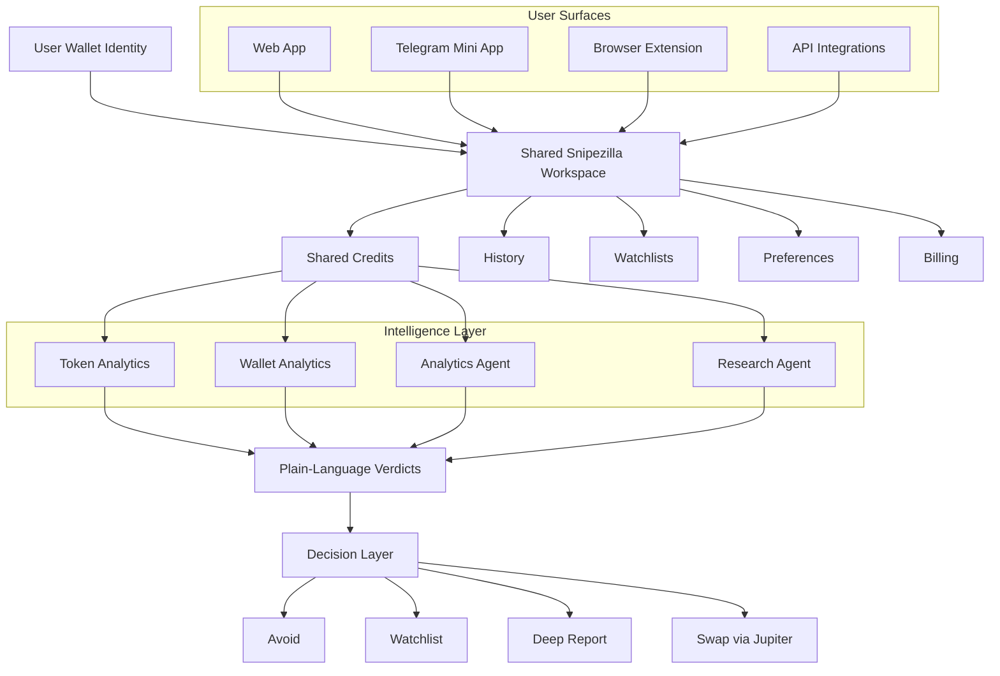

<p align="center">
  
</p>

<h1 align="center">Snipezilla AI</h1>
<div align="center">
  <p><strong>AI-native token and wallet intelligence for Solana traders</strong></p>
  <p>
    Token health • Wallet profiling • Narrative research • Multi-surface workflow • Credit-based AI actions
  </p>
</div>

<div align="center">

[](https://your-web-app-link)
[](https://t.me/your_mini_app)
[](https://your-docs-link)
[](https://x.com/your_account)
[](https://t.me/your_group)

</div>

> [!IMPORTANT]
> Snipezilla AI turns raw token, wallet, and narrative data into plain-language verdicts in seconds without forcing you to jump across scanners, charts, chats, and research tabs

> [!TIP]
> One wallet, one shared credit balance, one intelligence layer across Web App, Telegram Mini App, Browser Extension, and API flows

> [!WARNING]
> Snipezilla AI is non-custodial by design. It helps you evaluate setups and routes swaps through Jupiter on Solana, but every execution is still signed by your own wallet

> [!NOTE]
> The product is built for fast decision support, not blind automation. The strongest workflow is quick filter first, deeper report second, execution last

## One-Line Value

Turn raw token, wallet, and project signals into actionable Solana trading context in seconds without stitching together five separate tools

## Why It Wins

Snipezilla AI is built around one practical question: **is this structurally healthy, dangerously fragile, or worth a closer look**

Instead of giving you isolated metrics, it compresses liquidity quality, holder concentration, wallet behavior, volatility, and recent narrative changes into a readable verdict you can use immediately

| Category | What Snipezilla AI changes |
|---|---|
| Removes | Scanner hopping, manual wallet stalking, fragmented narrative checks |
| Speeds up | First-pass token and wallet evaluation from minutes to seconds |
| Replaces | The workflow of checking a DEX, explorer, scanner, Telegram chat, and news feed separately |
| Edge | One shared AI layer across web, chat, extension, and API with the same credits and the same judgment |

> [!TIP]
> This is not another chart-first tool pretending to be intelligence. Snipezilla AI is opinionated by design and prioritizes structure, behavior, and risk before hype

## Proof

Below is the kind of transformation the product is designed to deliver

### Input → Output Example

**Input**

```text
Token: 9xQeWvG816bUx9EPfD8kG6Xn7hRj5s1Tt9v7example
Request: quick token check
```

**Output**

```text
Verdict: High-risk microcap with thin liquidity and whale-heavy holder structure

Why it matters:
- Exit liquidity is weak for medium size entries
- Top holders control too much of the float
- Recent activity is aggressive but looks unstable

Suggested next step:
Avoid full size
Only worth deeper review if narrative catalyst is strong
```

That same logic also applies to wallet analysis

```text
Wallet verdict: Steady grinder with controlled sizing and consistent rotation
Style: swing trader
Risk level: moderate
What stands out: wins are smaller but repeatable, concentration is healthier than typical degen wallets
```

## Product View

Snipezilla AI is one intelligence workspace expressed through multiple surfaces



## Run in 60 Seconds

The first useful experience is intentionally simple: connect wallet, paste token or wallet, get a verdict, decide whether it deserves deeper credits

### 1) Connect

Sign in with a supported wallet and unlock your shared workspace across all surfaces

> [!IMPORTANT]
> Wallet sign-in uses a human-readable signature, not a spend approval and not a token transfer

### 2) Start with a quick check

Use a token mint, wallet address, ticker, or detected page context

```bash
POST /v1/agents/run
```

```json
{
  "agent_type": "token",
  "mode": "quick",
  "network": "solana",
  "input": {
    "token_address": "So11111111111111111111111111111111111111112"
  },
  "language": "en"
}
```

### 3) Expected result

You receive a compact verdict with the reason behind it, not just a raw metric dump

| Output block | What you see |
|---|---|
| Verdict | Structurally healthy, fragile, risky, or interesting |
| Risk framing | Liquidity weakness, concentration issues, behavior anomalies |
| Action path | Avoid, watch, go deeper, or open swap flow |

## Plug Anywhere

Snipezilla AI is designed to fit where the signal already appears first, instead of forcing users into one interface only

| Path | Best use |
|---|---|
| Web App | Full research mode, settings, billing, longer reports |
| Telegram Mini App | Fast token and wallet checks inside active chat flow |
| Browser Extension | Context overlays on scanners, DEX pages, and wallet views |
| API | Bot backends, dashboards, internal tooling, automation pipelines |
| Webhooks | Async jobs, alerts, result delivery into your own systems |

> [!NOTE]
> The same credit balance powers every surface, so users do not repeat work when they move from chat to desktop or from extension to backend

## Core Examples

### Quick token check

```js
import fetch from "node-fetch"

const API_KEY = process.env.SNIPEZILLA_API_KEY
const BASE_URL = "https://api.snipezilla.ai/v1"

async function runQuickTokenCheck(tokenAddress) {
  const response = await fetch(`${BASE_URL}/agents/run`, {
    method: "POST",
    headers: {
      Authorization: `Bearer ${API_KEY}`,
      "Content-Type": "application/json"
    },
    body: JSON.stringify({
      agent_type: "token",
      mode: "quick",
      network: "solana",
      input: { token_address: tokenAddress },
      language: "en"
    })
  })

  if (!response.ok) {
    throw new Error(`Request failed: ${response.status}`)
  }

  const data = await response.json()
  return data.result
}
```

### Quick wallet check

```python
import os
import requests

API_KEY = os.environ.get("SNIPEZILLA_API_KEY")
BASE_URL = "https://api.snipezilla.ai/v1"


def run_quick_wallet_check(wallet_address: str):
    response = requests.post(
        f"{BASE_URL}/agents/run",
        headers={
            "Authorization": f"Bearer {API_KEY}",
            "Content-Type": "application/json"
        },
        json={
            "agent_type": "wallet",
            "mode": "quick",
            "network": "solana",
            "input": {"wallet_address": wallet_address},
            "language": "en"
        },
        timeout=30
    )
    response.raise_for_status()
    return response.json()["result"]
```

### Async job for heavier analysis

```json
{
  "job_id": "job_01JDEFXYZ",
  "status": "queued",
  "agent_type": "wallet",
  "mode": "full",
  "estimated_credits": 6,
  "created_at": "2026-03-07T07:10:00Z"
}
```

### Webhook event

```json
{
  "event": "job.completed",
  "job_id": "job_01JDEFXYZ",
  "status": "completed",
  "agent_type": "wallet",
  "mode": "full",
  "credits_used": 6,
  "trace_id": "trace_9x8y7z",
  "timestamp": "2026-03-07T07:10:18Z"
}
```

## How It Works

Snipezilla AI sits on top of token analytics, wallet analytics, and research inputs, then converts that data into a plain-language verdict that is easier to act on than a dashboard full of disconnected numbers

1. A token, wallet, or project query enters through web, chat, extension, or API
2. The system pulls structural, behavioral, and narrative context for the selected object
3. Specialized agents evaluate health, risk, concentration, volatility, and recent changes
4. The result is compressed into a short verdict with red flags, green flags, and next-step guidance
5. The same result can lead into watchlisting, deeper research, or a Jupiter swap route on Solana

## Customization Surface

The product stays simple at the top layer, but there is enough control for different user types and integrations

| Surface | What can be adjusted |
|---|---|
| User settings | Default chain, language, notification style, report depth |
| Analysis mode | Quick check vs deeper report |
| API usage | Agent type, network, input object, language, job mode |
| Integration layer | Webhooks, retries, workers, bots, dashboards |
| Billing layer | Free credits, subscriptions, top-ups, token-based credit purchases |

> [!TIP]
> The cleanest usage pattern is to run cheap quick checks as a filter and reserve deeper reports for setups that already survived the first pass

## Credits and Token Model

Snipezilla AI uses credits as the unit of work and **$SNIPEZILLA** as the native utility token that can be used to purchase those credits

| Component | Role |
|---|---|
| Credits | Meter heavy actions such as token checks, wallet checks, and research calls |
| Free tier | 10 credits on first wallet connect |
| Subscriptions | Monthly bundles sized for different activity levels |
| Top-ups | One-off credit packages when users run out mid-cycle |
| Native token | Preferred payment rail for credits and future platform utility |
| Usage loop | Higher product usage can drive both token burn and treasury inflow |

> [!IMPORTANT]
> When credits are purchased with $SNIPEZILLA, the default economic design is 80% burn and 20% treasury, linking real product usage to both scarcity and sustainability

## Limits & Trade-Offs

Good repositories earn trust faster when they clearly state where the product stops being the right tool

| Area | Reality |
|---|---|
| Not a custody layer | Snipezilla AI never holds user funds |
| Not blind automation | It suggests paths, but the user still decides and signs |
| Not a guarantee engine | A structurally healthy token can still fail on narrative or timing |
| Not chain-maximal yet | Solana is the primary deep integration today |
| Not infinite free usage | Heavy actions consume credits and deeper analysis costs more |

> [!WARNING]
> This product is strongest as a decision support layer, not as a substitute for position sizing, timing discipline, or independent judgment

## Best Fit / Anti-Fit

| ✅ Ideal for | ❌ Not for |
|---|---|
| Solana traders who need fast first-pass risk framing | Users looking for fully automated copy trading |
| Researchers who want readable token and wallet context | Users who expect guaranteed alpha from a single score |
| Bot and dashboard builders who need agent-backed intelligence | Users who need deep multi-chain parity on day one |
| Telegram-native users who want one-tap checks in chat | Users who never plan to connect a wallet or use credits |

## Integration Notes

For product teams, bot builders, and infra operators, Snipezilla AI can also behave like a backend intelligence layer rather than a standalone app

- Use `/agents/run` for synchronous checks inside interfaces and bots
- Use jobs plus webhooks for heavier reports and multi-object processing
- Keep API keys server-side and verify webhook signatures
- Log `job_id` and `trace_id` for reliable debugging and replay handling

## Final Take

Snipezilla AI is built for the moment right before action

When a token shows up in chat, on a chart, inside a wallet, or inside your own tooling, it gives you one shared intelligence layer that answers the question that matters first: **should this move closer to your capital or further away from it**
